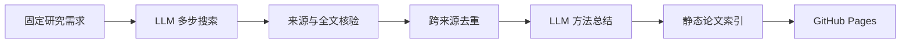

<div align="center">

# Awesome GNN

**面向文本属性图（TAG）与图学习分布外泛化（OOD）的论文研究雷达**

[在线浏览论文](https://liujiachen0x3f.github.io/Awesome-GNN/) · [使用 Skill](#用-codex-skill-更新论文) · [覆盖审计](docs/latest_conference_coverage_audit.md)


</div>

## 项目做什么

| 环节 | 实际行为 |
| --- | --- |
| 发现 | LLM 根据固定研究需求动态搜索 arXiv 和相关会议论文；另有按会议最新公开届次进行的独立补漏审计。 |
| 核验 | 程序复核标题、日期、会议主会归属和可获取的论文全文，不仅凭模型给出的题名入库。 |
| 筛选与去重 | 只展示 TAG 或图学习 OOD 相关论文，按 DOI、arXiv ID 与规范化标题跨来源合并。 |
| 总结 | LLM 阅读可提取的全文，生成 **151–200 个可见字符**的中文方法描述，加粗关键方法名称，并提供可回溯的原文证据。 |
| 发布 | 本地运行后导出静态 JSON；推送 `site/` 到 `main` 时由 GitHub Actions 更新 [GitHub Pages](https://liujiachen0x3f.github.io/Awesome-GNN/)。 |



网页支持按 TAG/OOD、来源和日期筛选，搜索标题、作者与方法，按发布时间排序；论文链接优先打开 PDF。会议卡片显示届次与简称，arXiv 卡片显示提交日期。页面只发布阅读所需的精简索引，不包含全文证据或 API 密钥。

## 用 Codex Skill 更新论文

整个可安装 Skill 都在 [`skills/gnn-paper-digest/`](skills/gnn-paper-digest/)：入口 `SKILL.md`、按需读取的操作参考和安装器均在这个文件夹。将**整个文件夹**放进 Codex 的 `skills` 目录即可使用；无需逐个复制文件。本仓库也提供一条安装命令：

```powershell
python skills/gnn-paper-digest/install.py
```

默认安装到 `$CODEX_HOME/skills/gnn-paper-digest`，未设置 `CODEX_HOME` 时安装到 `~/.codex/skills/gnn-paper-digest`。若已有不同版本，安装器会停止；确认要升级时运行 `python skills/gnn-paper-digest/install.py --replace`，旧版会先备份到 `~/.codex/skill-backups/`（或对应的 `$CODEX_HOME` 下）。

在 Codex 中打开本仓库，直接说：

```text
$gnn-paper-digest 检索 3 篇最新的 TAG/OOD 论文，核验并更新本地页面。
```

Skill 会读取项目状态，使用仓库内的固定需求 [`prompts/search.request.txt`](prompts/search.request.txt) 和总结规则，调用本地流水线并报告达到的数量与缺口。要改变研究需求，编辑该提示词文件；Skill 是操作入口，实际检索程序和数据仍在本仓库，**单独复制 Skill 文件夹不能替代项目代码**。

### 首次准备

需要 Python 3.11+，以及支持本项目检索工具调用和 Chat Completions 总结的 LLM 服务。在仓库根目录运行：

```powershell
python -m pip install -e .
Copy-Item .env.example .env
```

在本机 `.env` 中设置 `LLM_BASE_URL`、`LLM_API_KEY`、`LLM_MODEL`、`LLM_REASONING_EFFORT`；不要提交 `.env`。服务能力因供应商而异，配置格式见 [`.env.example`](.env.example)。没有自动定时采集，也不需要把密钥放进 GitHub Actions。

不用 Codex 时可直接运行同一流水线：

```powershell
python -X utf8 run.py search --limit 3
python -m http.server 8000 --directory site
```

浏览器打开 `http://localhost:8000` 查看结果。`--limit` 是目标数量，不保证一定找到；退出码 `0` 表示达到目标，`4` 表示有检索但不足，`2` 表示联网搜索失败。较大的 `--limit 100` 使用会议/年份批量搜索，目标为 80 篇会议 + 20 篇 arXiv；具体预算、续跑与结果文件见 [Skill 操作参考](skills/gnn-paper-digest/references/workflows.md)。

## 数据与发布

| 路径 | 用途 |
| --- | --- |
| [`prompts/`](prompts/) | 可修改的搜索需求、搜索代理与全文总结提示词 |
| [`data/papers.json`](data/papers.json) | 持久归档、去重身份与总结缓存；后续更新必须保留 |
| [`data/last_run.json`](data/last_run.json) | 最近运行的来源、拒绝原因和预算状态 |
| [`site/data/papers.json`](site/data/papers.json) | 页面读取的精简索引 |
| [`docs/latest_conference_coverage_audit.md`](docs/latest_conference_coverage_audit.md) | 最新会议届次、已入库与待处理范围 |
| [`memory.md`](memory.md) | 开发和核验记录 |

检索完成后，确认 `data/` 与 `site/` 的变化，再提交并推送到 `main`。工作流 [`.github/workflows/pages.yml`](.github/workflows/pages.yml) 在 `site/**` 变化时发布静态页面。会议目录或论文题名只是候选发现线索；访问失败、缺少全文和未完成的总结会保留为待处理项，不等同于“没有相关论文”。

## 开发验证

```powershell
python -m unittest discover -s tests -v
node --check site/app.js
```

项目代码采用 [MIT 许可证](LICENSE)。复用的第三方 RSS 解析代码及其许可保留在 `gnn_digest/vendor/`；论文内容和模型生成内容不因本仓库代码许可而改变原有权利。
